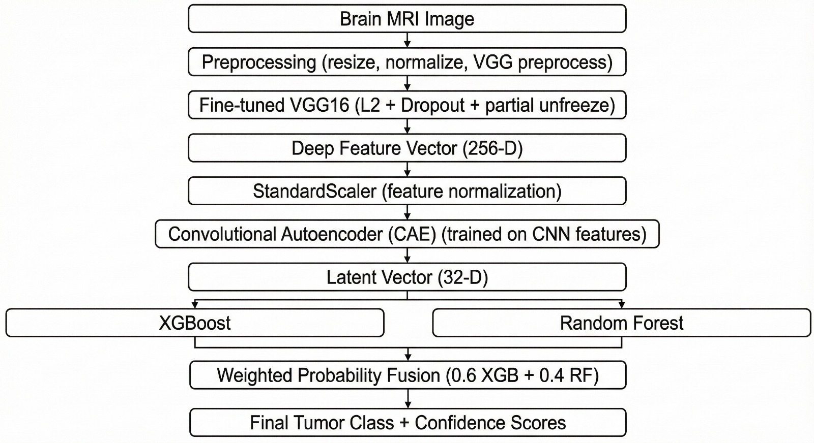

# BrainTumorDetectionModel_HDF-NET

A proposed machine learning model to detect Brain Tumor and classify into 4 different categories: **Glioma**, **Meningioma**, **Pituitary**, and **No Tumor**.

## Architecture

## Overview

This project implements the HDF-NET (Hierarchical Deep Fusion Network) model for brain tumor detection and classification using MRI scans.

## Features

- Brain tumor detection
- Multi-class classification (Glioma, Meningioma, Pituitary, No Tumor)
- Deep learning-based approach
- Streamlit web interface for easy inference

## Model Files

The trained model files (`.h5` format) are not included in this repository due to GitHub's file size limitations. Please train the model using the provided Jupyter notebooks or contact the repository owner for access to pre-trained weights.
